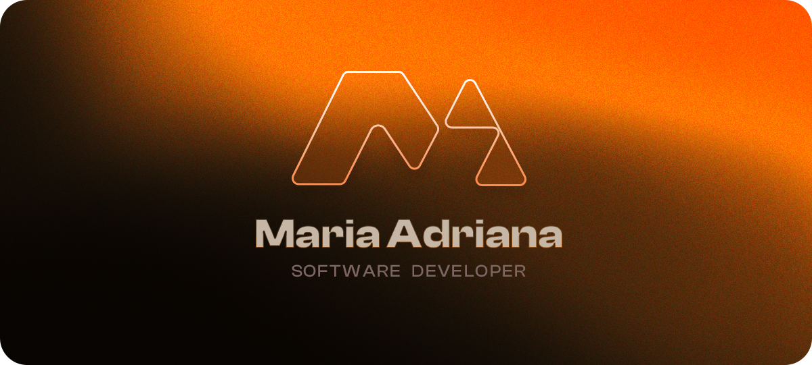

  

<h2 align="center" width="100%" style="margin-bottom: 30px;"> Software developer @ Deemaze Software</h2>

  
  
  
  

 
 

    
    
    
    

    
    
    

 
 
 
<table width="100%">
  <tr>
    <td width="50%" align="center" valign="top">
      
~ 🎧 ~

      
    </td>
    <td width="50%" align="center" valign="top">
      
~ 🎮 ~

      
    </td>
  </tr>
</table>
